# GlobeTrotter

A multi-city travel itinerary planner. Pick cities from a curated catalog, build a day-by-day schedule, keep an eye on your budget, and share a read-only public itinerary with anyone.

Built for the Odoo Hackathon with **Next.js 16 · React 19 · Tailwind CSS 4 · Drizzle ORM · PostgreSQL · Better Auth**.

| Light | Dark |
| --- | --- |
| 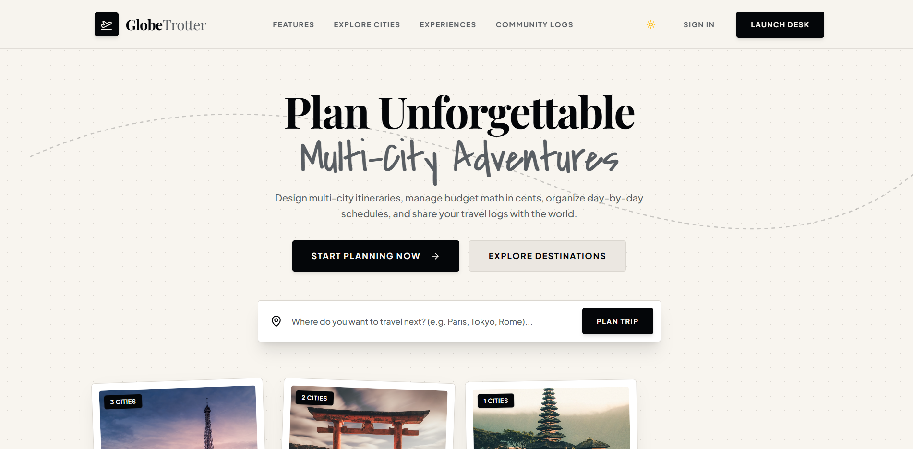 | 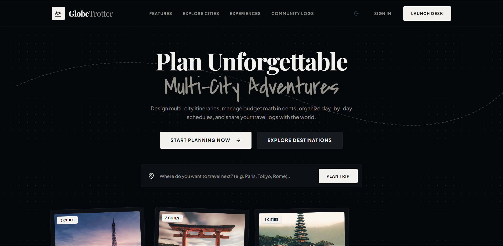 |

## Features

- **Email & password auth** — sessions handled by [Better Auth](https://www.better-auth.com/) (`/login`).
- **Dashboard** — overview of your trips at a glance.
- **Trips** — create trips, add city stops with arrival/departure dates, and reorder them.
- **Day-by-day builder** — schedule catalog or custom activities per stop, ordered within each day.
- **Explore** — browse 35+ seeded cities and their activities; save favorites to your profile.
- **Budget tracking** — set a trip budget, see totals per category, get over-budget alerts.
- **Calendar** — see all scheduled items across the whole trip.
- **Public sharing** — toggle a trip public and share a read-only itinerary link (no login required).
- **Graceful degradation** — every page falls back through API → localStorage → in-memory demo data, so the app still demos even if the database is offline.

## Screenshots

| | |
| --- | --- |
| 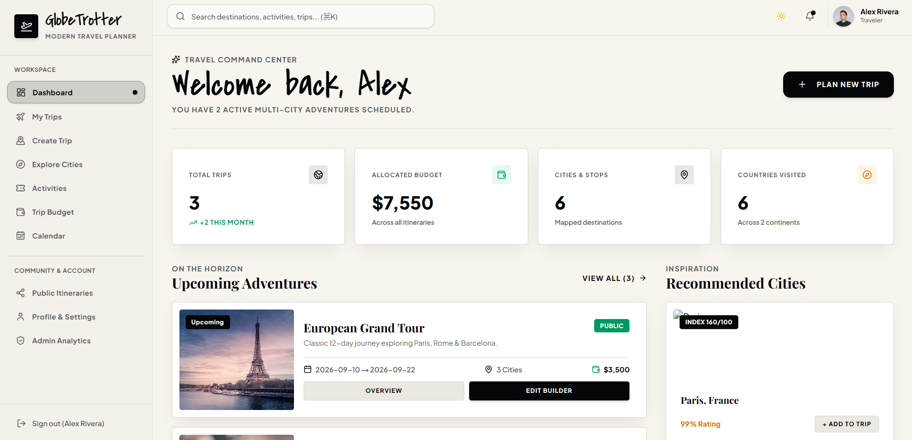 | 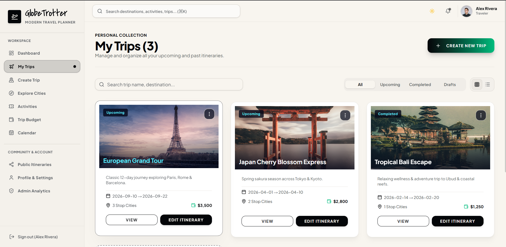 |
| **Dashboard** | **My trips** |
| 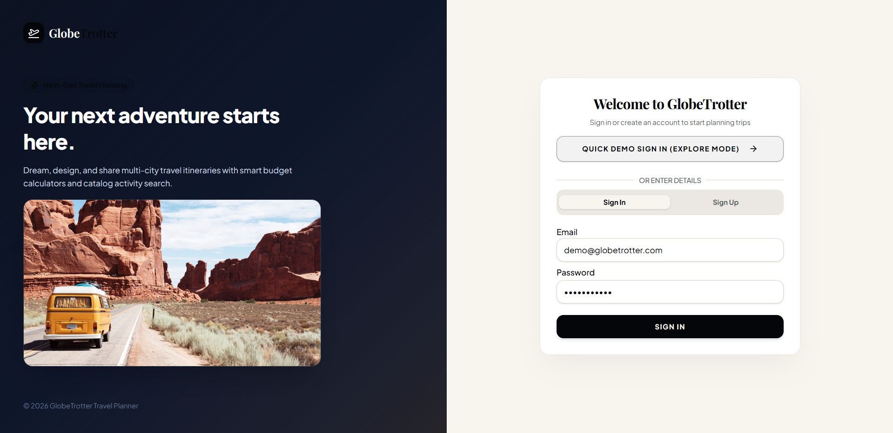 | 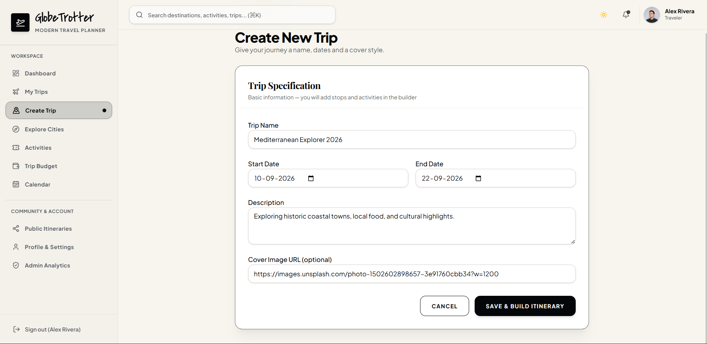 |
| **Auth** | **Trip creation** |
| 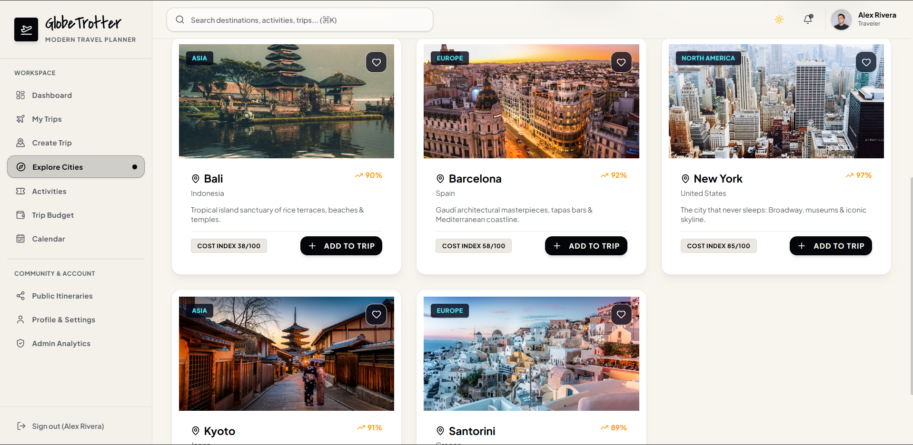 | 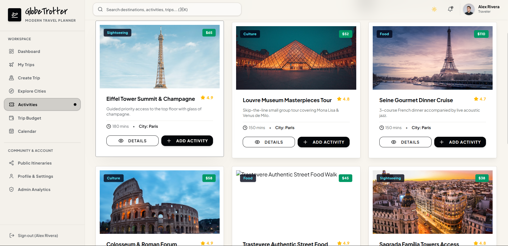 |
| **Explore cities** | **Activity catalog** |
| 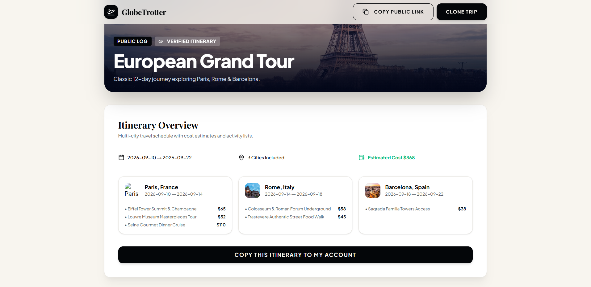 | 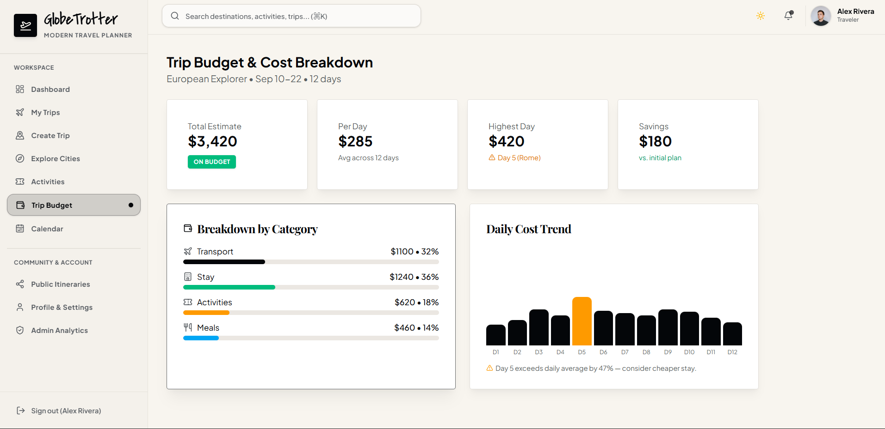 |
| **Shared public itinerary** | **Budget breakdown** |
| 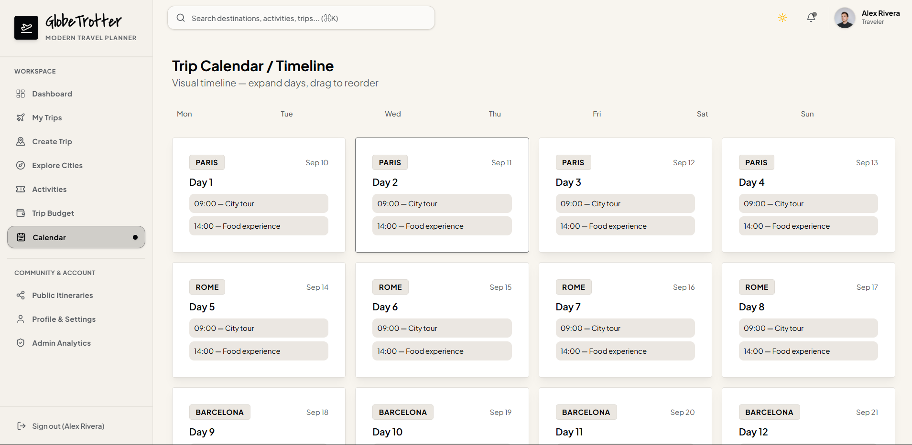 | 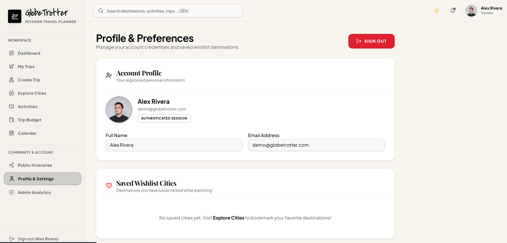 |
| **Calendar** | **Profile** |

<details>
<summary>Admin (static showcase page)</summary>

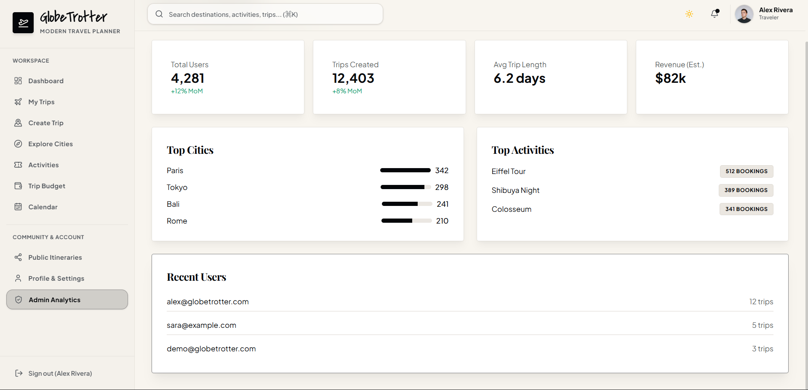

</details>

## Tech stack

| Layer | Choice |
| --- | --- |
| Framework | Next.js 16 (App Router), React 19 |
| Styling | Tailwind CSS 4, shadcn-style components (Radix UI + Base UI), lucide-react |
| Database | PostgreSQL 17 (Docker locally, Neon in production) |
| ORM | Drizzle ORM + drizzle-kit migrations |
| Auth | Better Auth (email/password) |
| Validation | Zod |
| Language | TypeScript (strict) |

## Getting started

Prerequisites: Node 20+, Docker Desktop, npm only (no pnpm/yarn/bun).

```bash
cp .env.example .env   # set a BETTER_AUTH_SECRET
docker compose up -d   # starts Postgres on port 5434
npm install
npm run db:push        # creates all tables
npm run db:seed        # optional: cities, activities, demo user & trips
npm run dev
```

Open [http://localhost:3000](http://localhost:3000).

### Environment variables

| Variable | Purpose |
| --- | --- |
| `DATABASE_URL` | Postgres connection string. Local default points at the Docker container; for production swap in a [Neon](https://neon.tech) pooled URL with `?sslmode=require`. |
| `BETTER_AUTH_SECRET` | Auth signing secret (`openssl rand -base64 32`). |

### Demo account

The seeder creates a ready-to-browse account:

```
email:    demo@globetrotter.app
password: demo1234
```

It also seeds two sample trips — **Japan Adventure** (Tokyo → Kyoto) and **European Highlights** (Paris → Rome, publicly shared).

## Useful scripts

| Command | What it does |
| --- | --- |
| `npm run dev` | Dev server |
| `npm run build` | Production build |
| `npm run start` | Serve the production build |
| `npm run lint` | ESLint |
| `npm run db:push` | Push schema changes to the DB |
| `npm run db:seed` | Seed cities, activities, demo user & trips |
| `npm run db:generate` | Generate SQL migrations |
| `npm run db:migrate` | Run SQL migrations |
| `npm run db:studio` | Browse data in Drizzle Studio |
| `npx tsx scripts/db-roundtrip.ts` | DB CRUD smoke test |
| `npx tsx scripts/smoke.ts` | HTTP API end-to-end test against a running server |

## Architecture

```
src/
├── app/                  # App Router pages
│   ├── api/              # REST endpoints (trips, stops, items, cities, sharing, auth)
│   ├── dashboard/        # Post-login overview
│   ├── explore/          # City & activity catalog
│   ├── trips/            # List, create, detail, day-by-day builder
│   ├── shared/[id]/      # Public read-only itinerary
│   ├── budget/           # Budget showcase
│   ├── calendar/         # Calendar showcase
│   └── profile/          # Account & saved cities
├── components/           # UI components (shadcn-style)
├── lib/
│   ├── auth/             # Better Auth client/server helpers
│   ├── db/               # Drizzle client + schema
│   ├── api-client.ts     # Typed fetch wrapper with localStorage fallback
│   └── data.ts           # In-memory demo data
└── server/
    ├── http.ts           # Route helpers (auth guards, error handling)
    ├── schemas.ts        # Zod request validation
    └── services/         # Domain logic per entity (trips, stops, items, cities…)
```

### Data model

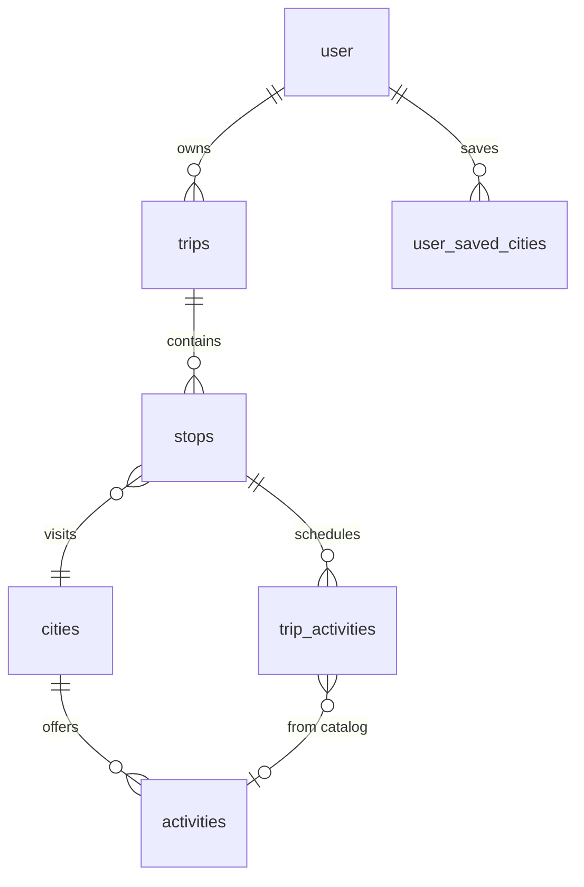

Core tables: `users`, `cities`, `activities`, `trips`, `stops`, `trip_activities`, `user_saved_cities`. Activity categories: sightseeing, food, adventure, culture, nightlife, transport, lodging, other.

## Design system

Theme is **"Ocean Emerald & Deep Midnight Glassmorphic Luxury"** — dark-mode-first slate canvas with glassmorphic surfaces, cyan→emerald gradients, OKLCH semantic tokens, and subtle hover-lift micro-interactions. Fonts: Plus Jakarta Sans, Playfair Display, Covered By Your Grace. See [DESIGN.md](DESIGN.md).

## Docs

- [`docs/PRD.md`](docs/PRD.md) — product requirements, API surface, screen map, priorities.
- [`DESIGN.md`](DESIGN.md) — design tokens and component patterns.
- [`docs/GlobeTrotter.pdf`](docs/GlobeTrotter.pdf) — original problem statement.

## Workflow

Branch → PR → code review → merge to `main`. Keep commits small with conventional prefixes (`feat:` `fix:` `docs:` `refactor:` `chore:`).
