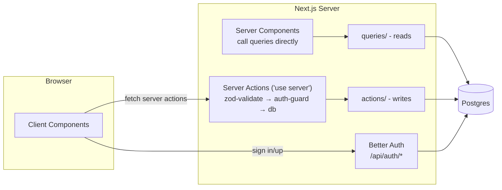
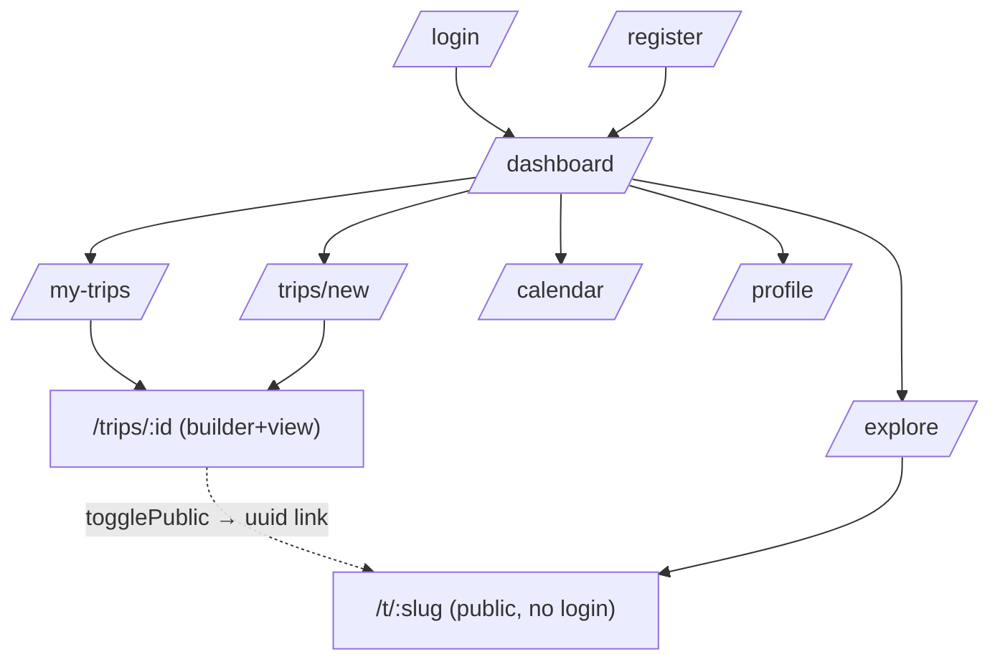

# GlobeTrotter — PRD

**Status:** locked plan · **Deadline:** today 5:00 PM · **Team:** 4 (1 backend, 2 frontend, 1 data/deploy)

Personalized multi-city travel planner: build trips as ordered city "sections", fill each day with activities, see budget split, share publicly, explore others' public trips.

---

## 1. Tech Stack

| Layer | Choice | Notes |
|---|---|---|
| Framework | Next.js 16 (App Router) | monolith — frontend + backend in one deploy |
| UI | React 19, Tailwind v4, shadcn/ui | no component library beyond shadcn |
| Validation | Zod 4 | one schema per write action |
| DB | PostgreSQL 17 (Docker locally, Neon on Vercel) | port **5434** locally |
| ORM | Drizzle | `db:push` for fast iteration |
| Auth | Better Auth v1.7 | email/password only, cookie sessions |
| Deploy | Vercel | images = external URLs, no uploads |

**Money rule:** all costs stored as integer cents (`costCents`). Never floats.
**Date rule:** dates are `"YYYY-MM-DD"` strings, times `"HH:mm"`. No timezones anywhere.

## 2. Architecture



- **No REST API.** Server components import `src/server/queries/*` directly.
- Mutations go through **server actions** (typed RPC from client components).
- Only real HTTP route: `/api/auth/[...all]` (Better Auth handler).
- Every query/action that touches private data starts with `requireUser()` → returns session or redirects to `/login`.

### Navigation / screens



## 3. Data Model

```mermaid
erDiagram
    user ||--o{ trips : owns
    user ||--o{ session : has
    user ||--o{ account : has
    user ||--o{ user_saved_cities : saves
    trips ||--|{ stops : contains
    stops }o--|| cities : located-in
    stops ||--o{ trip_activities : scheduled-as
    activities }o--|| cities : offered-in
    trip_activities }o--o| activities : snapshot-of

    user { text id PK
           text name
           text email UK
           boolean email_verified
           text image
           text phone
           text city
           text country }
    trips { text id PK
            text user_id FK
            text name
            date start_date
            date end_date
            int budget_cents
            boolean is_public
            text share_slug UK-null
            text cover_image_url }
    cities { text id PK
             text name
             text country
             text region
             real lat
             real lng
             int cost_index
             int popularity
             text image_url }
    activities { text id PK
                 text city_id FK
                 text title
                 text description
                 enum category
                 int duration_mins
                 int cost_cents
                 text image_url }
    stops { text id PK
            text trip_id FK
            text city_id FK
            int position
            date arrival_date
            date departure_date }
    trip_activities { text id PK
                      text stop_id FK
                      text activity_id FK-null
                      text title
                      enum category
                      int duration_mins
                      int cost_cents
                      date date
                      text start_time
                      int position }
    user_saved_cities { text user_id PK,FK
                        text city_id PK,FK }
```

Key decisions:
- `trip_activities` stores a **snapshot** (title/category/duration/cost copied on insert). Editing the catalog later never mutates old trips; budget math needs zero joins to `activities`.
- `stops` = the mockup's "sections". Ordering via `position` integers (gap numbering 0,1000,2000…); reorder writes the whole list inside one transaction — no unique constraint to fight.
- Sharing = `is_public` + `share_slug` (uuid). Partial unique index: only non-null slugs are unique.

## 4. Backend Surface

### 4.1 Reads (`src/server/queries/*.ts`) — called from server components

| Query | Input → Output | Used by |
|---|---|---|
| `getMyTrips` | session → `Trip[]` + per-trip `{ stopCount, totalCostCents }` | Dashboard, My Trips, Calendar, Profile |
| `getTrip(tripId)` | id → `{ trip, stops: (Stop & {city})[], items: ItineraryItem[] }` | Builder, View, Budget page |
| `searchCities({ q?, country?, region?, page })` | → `Page<City>` (20/page) | Create Trip suggestions, City Search modal |
| `getTopCities(limit=8)` | → `City[]` by popularity | Dashboard |
| `searchActivities({ cityId, category?, maxCost?, maxDuration?, q?, page })` | → `Page<Activity>` (20/page) — PDF asks for type/cost/**duration** filters | Activity Search modal |
| `getPublicTrip(slug)` | slug → same shape as `getTrip`, **no auth**, 404 if not public | Share page `/t/[slug]` |
| `getPublicTrips(page)` | → `Page<{ trip, ownerName, ownerImage, stopCount }>` (12/page) | Explore |

### 4.2 Writes (`src/server/actions/*.ts`) — zod-validated server actions

| Action | Input (zod) | Effect |
|---|---|---|
| `createTrip` | `{ name, startDate, endDate, description?, coverImageUrl? }` | creates trip, redirects to builder |
| `updateTrip` | partial of above + `{ budgetCents? }` | updates own trip |
| `deleteTrip` | `{ tripId }` | cascade delete |
| `addStop` | `{ tripId, cityId, arrivalDate, departureDate }` | appends at end |
| `updateStop` | `{ stopId, arrivalDate?, departureDate? }` | re-checks item dates |
| `removeStop` | `{ stopId }` | cascades items |
| `moveStop` | `{ tripId, stopId, direction: up\|down }` | swaps positions in 1 transaction |
| `addItemFromCatalog` | `{ stopId, activityId, date, startTime? }` | copies catalog row into snapshot |
| `addItemCustom` | `{ stopId, title, category, costCents?, durationMins?, date, startTime? }` | free-text entry |
| `removeItem` | `{ itemId }` | delete |
| `moveItem` | `{ itemId, direction }` | swap within same day |
| `togglePublic` | `{ tripId }` | flips flag; generates `shareSlug` when turning on |
| `saveCity` / `unsaveCity` | `{ cityId }` | profile saved list |

Ownership check on every action: `WHERE trips.userId = session.user.id`.

### 4.3 Auth routes (Better Auth, prebuilt)

`POST /api/auth/sign-up/email` · `POST /api/auth/sign-in/email` · `POST /api/auth/sign-out` · `GET /api/auth/get-session`. Client wrapper: `src/lib/auth/client.ts`.

## 5. Screen ↔ Data Map

| # | Screen (mockup) | Route | Gets data from |
|---|---|---|---|
| 1–2 | Login / Register | `/login`, `/register` | `authClient.signIn/signUp` (client) |
| 3 | Landing/Dashboard | `/dashboard` | `session`, `getMyTrips`, `getTopCities(8)` |
| 4 | Create Trip | `/trips/new` | form → `createTrip`; suggestion grid → `searchActivities(cityId)` preview |
| 5 | Build Itinerary (sections) | `/trips/[id]` | `getTrip(id)`; modals call `searchCities` / `searchActivities`; buttons fire add/update/move/remove actions |
| 6 | My Trips (Ongoing/Upcoming/Completed) | `/trips` | `getMyTrips` — grouping done client-side vs today's date |
| 7 | Profile | `/profile` | session user, `getMyTrips`, saved cities |
| 8 | City/Activity Search | modal over builder | `searchCities`, `searchActivities` with filters + pagination |
| 9 | Itinerary View + Budget | `/trips/[id]?view=read` | same single `getTrip(id)` payload — frontend groups items by day, sums by category/date. No separate budget endpoint. |
| 10 | Community tab → **Explore** | `/explore` | `getPublicTrips(page)` |
| 11 | Calendar View | `/calendar` | `getMyTrips` — draws bars between start/end dates |
| 12 | Admin Panel | — | **CUT** (optional in spec) |

Overbudget-day alert (screen 9): compare each day's sum against `budgetCents ÷ tripDays` — computed client-side from `getTrip` payload. Same payload gives **average cost per day** (PDF requirement) for free.

## 6. Joins & Aggregations (where they happen)

| Need | SQL shape |
|---|---|
| Full itinerary | `stops ⋈ cities` then `trip_activities WHERE stop_id IN (...)` — 2 queries, assembled in code |
| Section (stop) subtotal | `SUM(cost_cents) GROUP BY stop_id` |
| Budget breakdown pie | `SUM(cost_cents) GROUP BY category` for trip |
| Overbudget days | `SUM(cost_cents) GROUP BY date HAVING ...` |
| My Trips card stats | `COUNT(stops)` + `SUM(items.cost_cents)` per trip (lateral or subquery) |
| Explore cards | `trips WHERE is_public ⋈ user(name,image)` + stop count |

## 7. Pagination

Only where lists can get long:

| List | Strategy | Page size |
|---|---|---|
| `searchCities` | offset (`page` param), returns `{ items, total }` | 20 |
| `searchActivities` | offset, same envelope | 20 |
| Explore public trips | offset | 12 |
| My Trips | none — fetch all (a user has few) | — |
| Itinerary items | none — full trip in one payload | — |

Shared type: `type Page<T> = { items: T[]; total: number; page: number }`.

Offset (not keyset) is deliberate: simplest shadcn pagination UI, datasets are small (~600 cities).

## 8. Feature List & Priorities

**P0 (by 1 PM)** — auth, create/list trips, add sections+cities, add activities, day-by-day view.
**P1 (by 3:30 PM)** — budget page, public share page (+ social-share buttons = plain `<a>` links to Twitter/WhatsApp/LinkedIn), dashboard, Explore.
**P2 (if time)** — calendar bars, copy-trip button, saved cities UI.

**Pre-agreed cuts:** drag-and-drop (arrows instead), image upload (URLs only), password reset email (fake toast), OAuth, admin panel (optional in PDF), community posts feed (replaced by Explore), profile extras — language preference and delete-account are display-only or skipped.

## 9. Demo Script (for judges)

1. Login as demo account → populated dashboard.
2. Create "Japan Adventure", add Tokyo section, pick activities from search.
3. Show day view + budget pie, set low budget → overbudget alert appears.
4. Toggle public → open share URL in incognito → read-only trip.
5. Explore page → open someone else's trip.

## 10. Workflow

Branch → PR → code review → merge to `main`. npm only. Working skeleton by 1 PM beats polished nothing at 5.

## 11. References (source docs, in `docs/`)

- **`GlobeTrotter.pdf`** — official problem statement: vision, 13 screens, feature requirements. Every screen in section 5 maps to it; deviations are listed as cuts in section 8.
- **`GlobeTrotter - 8 hours.png`** — team mockup (12 screens). "Sections" in screen 5 = our `stops` table; screen 10 Community tab intentionally re-scoped to Explore (see PRD section 5).
- Mockup source: https://link.excalidraw.com/l/65VNwvy7c4X/6CzbTgEeSr1

