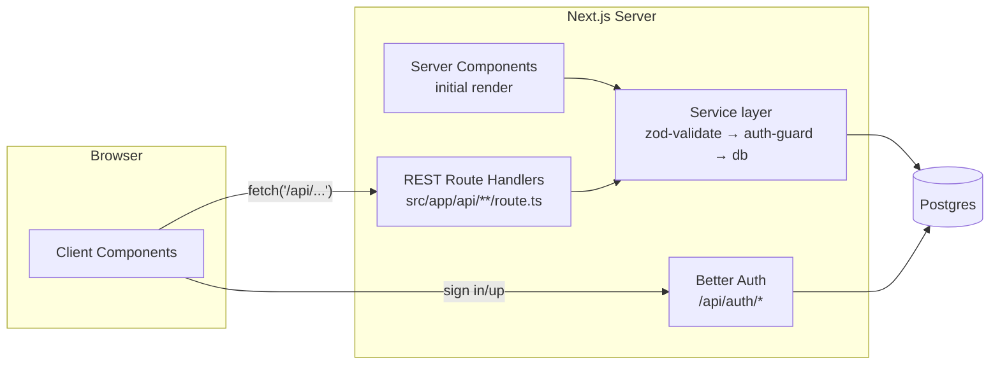
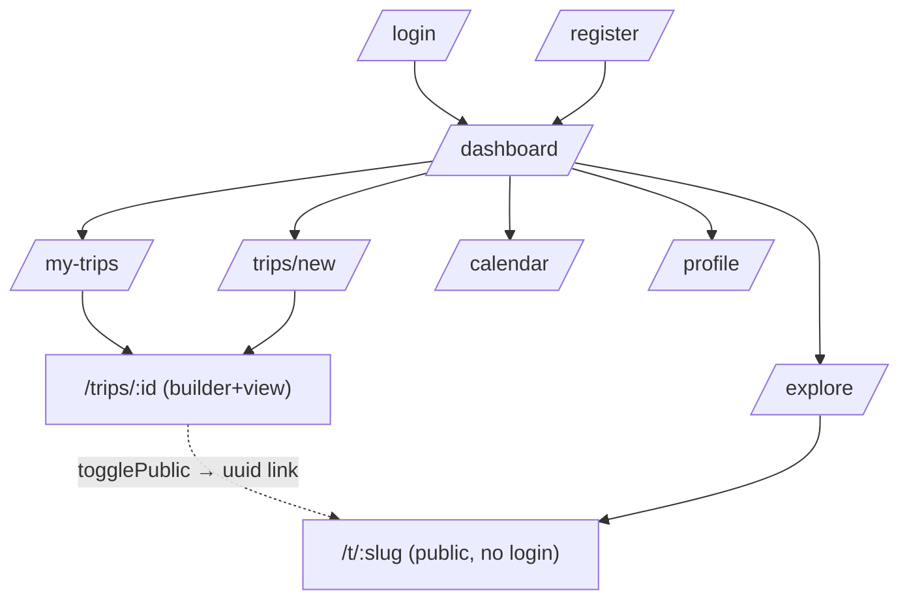

# GlobeTrotter — PRD

**Status:** locked plan · **Deadline:** today 5:00 PM · **Team:** 4 (1 backend, 2 frontend, 1 data/deploy)

Personalized multi-city travel planner: build trips as ordered city "sections", fill each day with activities, see budget split, share publicly, explore others' public trips.

---

## 1. Tech Stack

| Layer | Choice | Notes |
|---|---|---|
| Framework | Next.js 16 (App Router) | monolith — frontend + backend in one deploy |
| UI | React 19, Tailwind v4, shadcn/ui | no component library beyond shadcn |
| Validation | Zod 4 | one schema per write action |
| DB | PostgreSQL 17 (Docker locally, Neon on Vercel) | port **5434** locally |
| ORM | Drizzle | `db:push` for fast iteration |
| Auth | Better Auth v1.7 | email/password only, cookie sessions |
| Deploy | Vercel | images = external URLs, no uploads |

**Money rule:** all costs stored as integer cents (`costCents`). Never floats.
**Date rule:** dates are `"YYYY-MM-DD"` strings, times `"HH:mm"`. No timezones anywhere.

## 2. Architecture



- **REST style**: every backend operation is a route handler (`route.ts`) returning JSON. No server actions.
- Handlers stay thin: they parse params/input, then call functions in `src/server/services/*` (so server components reuse them for first render).
- Only non-domain route: `/api/auth/[...all]` (Better Auth handler).
- Every protected endpoint calls `requireUser()` → session or `401`.
- Next 16 gotcha: dynamic route `params` is a **Promise** — always `const { tripId } = await params`.

### Navigation / screens



## 3. Data Model

```mermaid
erDiagram
    user ||--o{ trips : owns
    user ||--o{ session : has
    user ||--o{ account : has
    user ||--o{ user_saved_cities : saves
    trips ||--|{ stops : contains
    stops }o--|| cities : in_city
    stops ||--o{ trip_activities : schedules
    activities }o--|| cities : offered_in
    trip_activities }o--o| activities : snapshots

    user { text id PK
           text name
           text email UK
           boolean email_verified
           text image
           text phone
           text city
           text country }
    trips { text id PK
            text user_id FK
            text name
            date start_date
            date end_date
            int budget_cents
            boolean is_public
            text share_slug UK
            text cover_image_url }
    cities { text id PK
             text name
             text country
             text region
             real lat
             real lng
             int cost_index
             int popularity
             text image_url }
    activities { text id PK
                 text city_id FK
                 text title
                 text description
                 enum category
                 int duration_mins
                 int cost_cents
                 text image_url }
    stops { text id PK
            text trip_id FK
            text city_id FK
            int position
            date arrival_date
            date departure_date }
    trip_activities { text id PK
                      text stop_id FK
                      text activity_id FK-null
                      text title
                      enum category
                      int duration_mins
                      int cost_cents
                      date date
                      text start_time
                      int position }
    user_saved_cities { text user_id PK,FK
                        text city_id PK,FK }
```

Key decisions:
- `trip_activities` stores a **snapshot** (title/category/duration/cost copied on insert). Editing the catalog later never mutates old trips; budget math needs zero joins to `activities`.
- `stops` = the mockup's "sections". Ordering via `position` integers (gap numbering 0,1000,2000…); reorder writes the whole list inside one transaction — no unique constraint to fight.
- Sharing = `is_public` + `share_slug` (uuid). Partial unique index: only non-null slugs are unique.

## 4. Backend Surface (REST)

All handlers in `src/app/api/**/route.ts`, logic in `src/server/services/*`. Conventions:
- Auth: session cookie (Better Auth) → `requireUser()` per handler. Public endpoints marked **no-auth**.
- Success: `200` with JSON body. Paginated lists: `{ items, total, page }`.
- Errors: `400` zod fail · `401` not signed in · `403` not owner · `404` missing · body `{ error: string }`.

### 4.1 Trips

| Method + Path | In → Out | Notes |
|---|---|---|
| `GET /api/trips` | → `Trip[]` each with `stopCount`, `totalCostCents` | own trips only |
| `POST /api/trips` | `{ name, startDate, endDate, description?, coverImageUrl? }` → `Trip` | |
| `GET /api/trips/:tripId` | → `{ trip, stops: (Stop&{city})[], items: ItineraryItem[] }` | the one payload powering builder/view/budget |
| `PATCH /api/trips/:tripId` | partial of create + `budgetCents?` → `Trip` | |
| `DELETE /api/trips/:tripId` | → `{ ok: true }` | cascades stops/items |

### 4.2 Stops (= mockup sections)

| Method + Path | In → Out | Notes |
|---|---|---|
| `POST /api/trips/:tripId/stops` | `{ cityId, arrivalDate, departureDate }` → `Stop` | appended at end |
| `PATCH /api/stops/:stopId` | `{ arrivalDate?, departureDate? }` → `Stop` | |
| `DELETE /api/stops/:stopId` | → `{ ok: true }` | cascades items |
| `POST /api/stops/:stopId/move` | `{ direction: "up"\|"down" }` → `Stop[]` | position swap, 1 transaction |

### 4.3 Itinerary items

| Method + Path | In → Out | Notes |
|---|---|---|
| `POST /api/stops/:stopId/items` | catalog variant `{ activityId, date, startTime? }` or custom variant `{ title, category, costCents?, durationMins?, date, startTime? }` → `ItineraryItem` | snapshot copied on insert |
| `PATCH /api/items/:itemId` | `{ date?, startTime?, costCents?, position? }` → `ItineraryItem` | |
| `DELETE /api/items/:itemId` | → `{ ok: true }` | |
| `POST /api/items/:itemId/move` | `{ direction: "up"\|"down" }` → `ItineraryItem[]` | within same day |

### 4.4 Sharing

| Method + Path | In → Out | Notes |
|---|---|---|
| `POST /api/trips/:tripId/share` | `{ isPublic: boolean }` → `{ isPublic, shareSlug? }` | generates uuid slug when turning on |
| `GET /api/public/trips?page=` | → `Page<{ trip, ownerName, ownerImage, stopCount }>` (12/page) | **no-auth**, Explore grid |
| `GET /api/public/trips/:slug` | → same shape as trip GET | **no-auth**, share page; 404 unless public |

### 4.5 Search & misc

| Method + Path | In → Out | Notes |
|---|---|---|
| `GET /api/cities?q=&country=&region=&page=` | → `Page<City>` (20/page) | |
| `GET /api/cities/top?limit=8` | → `City[]` by popularity | dashboard |
| `GET /api/cities/:cityId/activities?category=&maxCost=&maxDuration=&q=&page=` | → `Page<Activity>` (20/page) | type/cost/duration filters per PDF |
| `GET /api/me/saved-cities` | → `City[]` | profile |
| `PUT /api/me/saved-cities/:cityId` / `DELETE …` | → `{ ok: true }` | save/unsave |

### 4.6 Auth routes (Better Auth, prebuilt)

`POST /api/auth/sign-up/email` · `POST /api/auth/sign-in/email` · `POST /api/auth/sign-out` · `GET /api/auth/get-session`. Client wrapper: `src/lib/auth/client.ts`. Frontend calls REST via a thin typed helper `src/lib/api-client.ts` (`api.get/post/patch/delete`) that throws on non-2xx.

Route-handler folder map:

```
src/app/api/
├── auth/[...all]/route.ts
├── trips/route.ts                      # GET list, POST create
├── trips/[tripId]/route.ts             # GET full, PATCH, DELETE
├── trips/[tripId]/share/route.ts       # POST toggle public
├── trips/[tripId]/stops/route.ts       # POST add stop
├── stops/[stopId]/route.ts             # PATCH, DELETE
├── stops/[stopId]/move/route.ts        # POST reorder
├── stops/[stopId]/items/route.ts       # POST add item
├── items/[itemId]/route.ts             # PATCH, DELETE
├── items/[itemId]/move/route.ts        # POST reorder
├── cities/route.ts                     # GET search
├── cities/top/route.ts                 # GET top
├── cities/[cityId]/activities/route.ts # GET activities for city
├── public/trips/route.ts               # GET explore (no-auth)
├── public/trips/[slug]/route.ts        # GET shared trip (no-auth)
└── me/saved-cities/[cityId]/route.ts   # PUT / DELETE (+ GET on saved-cities)
```

Ownership check on every private endpoint: `WHERE trips.userId = session.user.id`.

## 5. Screen ↔ Data Map

| # | Screen (mockup) | Route | Gets data from |
|---|---|---|---|
| 1–2 | Login / Register | `/login`, `/register` | `authClient.signIn/signUp` (client) |
| 3 | Landing/Dashboard | `/dashboard` | `GET /api/trips`, `GET /api/cities/top?limit=8` |
| 4 | Create Trip | `/trips/new` | form → `POST /api/trips`; suggestion grid → `GET /api/cities/:cityId/activities` preview |
| 5 | Build Itinerary (sections) | `/trips/[id]` | `GET /api/trips/:tripId`; modals call `GET /api/cities`, `GET /api/cities/:cityId/activities`; buttons fire the stop/item endpoints (4.2, 4.3) |
| 6 | My Trips (Ongoing/Upcoming/Completed) | `/trips` | `GET /api/trips` — grouping done client-side vs today's date |
| 7 | Profile | `/profile` | session user, `GET /api/trips`, `GET /api/me/saved-cities` |
| 8 | City/Activity Search | modal over builder | `GET /api/cities`, `GET /api/cities/:cityId/activities` with filters + pagination |
| 9 | Itinerary View + Budget | `/trips/[id]?view=read` | same single `GET /api/trips/:tripId` payload — frontend groups items by day, sums by category/date. No separate budget endpoint. |
| 10 | Community tab → **Explore** | `/explore` | `GET /api/public/trips?page=` |
| 11 | Calendar View | `/calendar` | `GET /api/trips` — draws bars between start/end dates |
| 12 | Admin Panel | — | **CUT** (optional in spec) |

Overbudget-day alert (screen 9): compare each day's sum against `budgetCents ÷ tripDays` — computed client-side from the trip payload. Same payload gives **average cost per day** (PDF requirement) for free.

## 6. Joins & Aggregations (where they happen)

| Need | SQL shape |
|---|---|
| Full itinerary | `stops ⋈ cities` then `trip_activities WHERE stop_id IN (...)` — 2 queries, assembled in code |
| Section (stop) subtotal | `SUM(cost_cents) GROUP BY stop_id` |
| Budget breakdown pie | `SUM(cost_cents) GROUP BY category` for trip |
| Overbudget days | `SUM(cost_cents) GROUP BY date HAVING ...` |
| My Trips card stats | `COUNT(stops)` + `SUM(items.cost_cents)` per trip (lateral or subquery) |
| Explore cards | `trips WHERE is_public ⋈ user(name,image)` + stop count |

## 7. Pagination

Only where lists can get long:

| List | Strategy | Page size |
|---|---|---|
| `searchCities` | offset (`page` param), returns `{ items, total }` | 20 |
| `searchActivities` | offset, same envelope | 20 |
| Explore public trips | offset | 12 |
| My Trips | none — fetch all (a user has few) | — |
| Itinerary items | none — full trip in one payload | — |

Shared type: `type Page<T> = { items: T[]; total: number; page: number }`.

Offset (not keyset) is deliberate: simplest shadcn pagination UI, datasets are small (~600 cities).

## 8. Feature List & Priorities

**P0 (by 1 PM)** — auth, create/list trips, add sections+cities, add activities, day-by-day view.
**P1 (by 3:30 PM)** — budget page, public share page (+ social-share buttons = plain `<a>` links to Twitter/WhatsApp/LinkedIn), dashboard, Explore.
**P2 (if time)** — calendar bars, copy-trip button, saved cities UI.

**Pre-agreed cuts:** drag-and-drop (arrows instead), image upload (URLs only), password reset email (fake toast), OAuth, admin panel (optional in PDF), community posts feed (replaced by Explore), profile extras — language preference and delete-account are display-only or skipped.

## 9. Demo Script (for judges)

1. Login as demo account → populated dashboard.
2. Create "Japan Adventure", add Tokyo section, pick activities from search.
3. Show day view + budget pie, set low budget → overbudget alert appears.
4. Toggle public → open share URL in incognito → read-only trip.
5. Explore page → open someone else's trip.

## 10. Workflow

Branch → PR → code review → merge to `main`. npm only. Working skeleton by 1 PM beats polished nothing at 5.

**Micro-commits.** Huge commits are painful to review and impossible to bisect when a bug sneaks in. Rules:
- One logical change per commit — a commit should be reviewable in under ~60 seconds.
- Commit every time something small becomes true: `feat: addStop action`, `fix: guard moveStop against empty trip`, `chore: seed paris activities`.
- Conventional prefixes so scanning history is fast: `feat:` `fix:` `docs:` `refactor:` `chore:`.
- Never mix "add feature X" with "also fixed unrelated thing Y" in one commit — Y gets its own.
- Push often; rebase instead of merge commits inside a PR.
- PRs stay small too: if a PR touches >10 files, split it.

## 11. References (source docs, in `docs/`)

- **`GlobeTrotter.pdf`** — official problem statement: vision, 13 screens, feature requirements. Every screen in section 5 maps to it; deviations are listed as cuts in section 8.
- **`GlobeTrotter - 8 hours.png`** — team mockup (12 screens). "Sections" in screen 5 = our `stops` table; screen 10 Community tab intentionally re-scoped to Explore (see PRD section 5).
- Mockup source: https://link.excalidraw.com/l/65VNwvy7c4X/6CzbTgEeSr1

